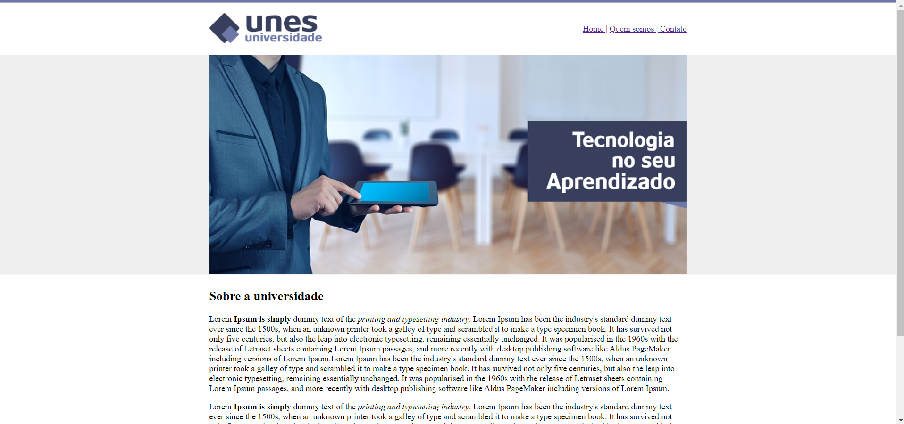
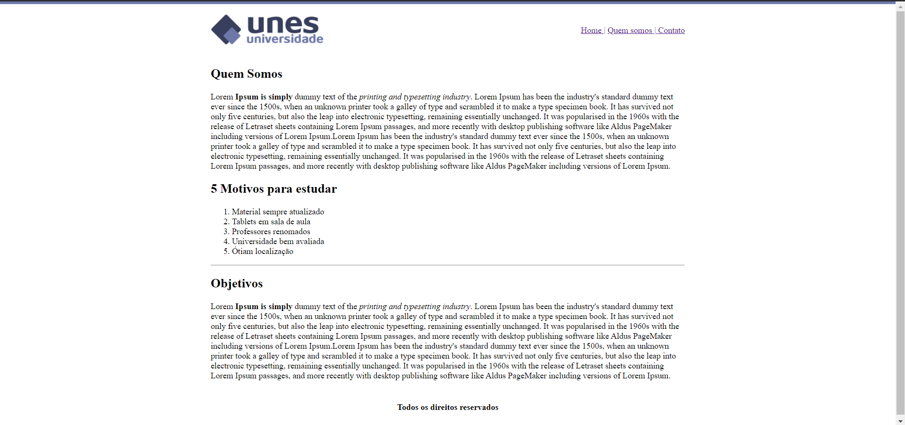
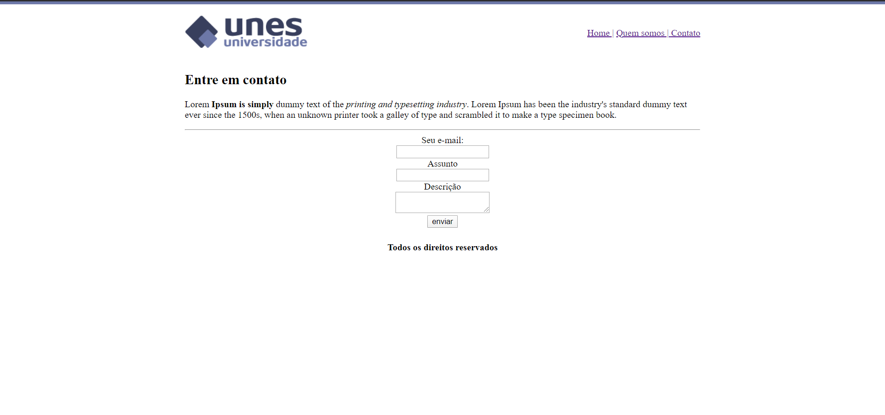

<h1 align="center">Projet UNES - Universidade</h1>

Projeto <strong>UNES - Universidade</strong> Desenvolvido durante o curso "Desenvolvimento Web Completo 2020" ministrado por  Jorge Sant Ana e Jamilton Damasceno por meio da plataforma de ensino da <a href ="https://www.udemy.com/">Udemy<a>

<hl>

## :rocket: Tecnologias utilizadas:

  [Html](https://www.w3schools.com/html/default.asp)
| [CSS](https://www.w3schools.com/css/)

## 💻 Projeto

#### Este projeto teve como objetivo criar um Front-end simples utilizando HTML para um site de uma Universidade fictícia de nome "UNES - Universidade"

## Front-end
#### Página "Home":
 

#### Página "Quem somos":

#### Página "Contato":

## E em relação ao aprendizado?

Nesse projeto coloquei em prática parte do conhecimento sobre HTML adquirido no curso citado anteriormente

Feito com ❤️ por Luciano A. Teles